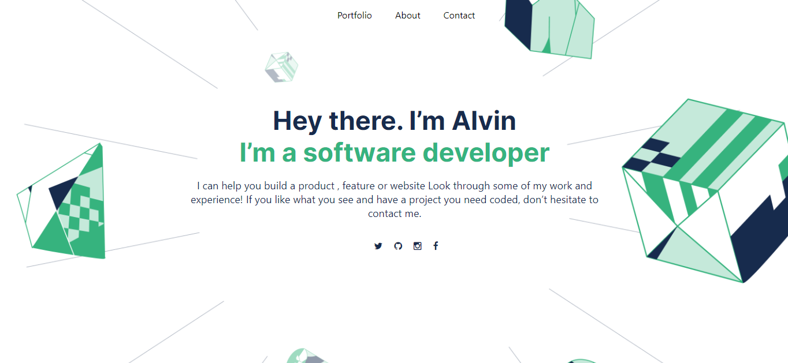

# Portfolio: setup and mobile version skeleton

> In this project i am building a personal portfolio website, by parsing the figma design to create the user interface for the website.

The main objectives for this project are:

1. To Understand how to parse a Figma design to create a UI.
2. Use of Flexbox to place elements in the page.
3. Build a personal portfolio site.
4. Use images and backgrounds to enhance the look of the website.

## live Demo(https://raw.githack.com/alvinlouis29/portifolio-website/Recent_section/index.html)
## Built With

- Html
- Css

👤 **Alvin Louis**

- GitHub: [@githubhandle](https://github.com/alvinlouis29)
- Twitter: [@twitterhandle](https://twitter.com/louisssegawa)
- LinkedIn: [LinkedIn](https://www.linkedin.com/in/alvin-louis-632026183/)

## 🤝 Contributing

Contributions, issues, and feature requests are welcome!

Feel free to check the [issues page](../../issues/).

## Show your support

Give a ⭐️ if you like this project!

## 📝 License

This project is [MIT](./MIT.md) licensed.
